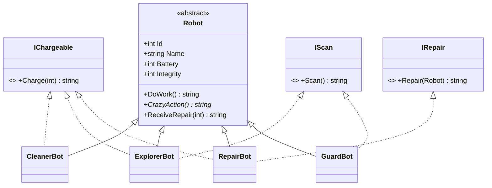

# Robotite planeet (Robot Planet)

WPF-rakendus, kus erinevad robotid elavad samas maailmas, kuid käituvad erinevalt. Lahendus koosneb eraldi Core- ja WPF-projektist ning kasutab pärilust, liideseid, polümorfismi ja kollektsiooni (`ObservableCollection<Robot>`).

## 1. Valitud maailm ja rakenduse eesmärk

Valitud maailm: **ROBOT PLANET**. Planeedil elavad neli tüüpi roboteid: `CleanerBot`, `ExplorerBot`, `RepairBot` ja `GuardBot`. Neil on ühine baastüüp `Robot` (aku ja terviklikkus), kuid igaühel on oma tavaline tegevus, oma võimed (liidesed) ja oma hullumeelne tegevus `CrazyAction()`.

Rakenduse eesmärk on näidata OOP põhimõtteid humoorikal viisil. Kasutaja saab roboteid lisada, valida ja eemaldada, käivitada nende tegevusi ning jälgida tulemusi logis. Kõik domeenireeglid asuvad Core-projektis, WPF ainult juhib ja kuvab.

## 2. Käivitamisjuhend

**Nõuded:** Windows 10/11, .NET 10 SDK, Visual Studio töökoormusega *.NET desktop development*.

```bash
git clone <REPOSITORY-URL>
cd RobotPlanet
dotnet run --project RobotPlanet.Wpf
```

Alternatiiv: ava `RobotPlanet.sln` Visual Studios, määra `RobotPlanet.Wpf` käivitusprojektiks ja vajuta **F5**.

Käivitamisel lisatakse automaatselt neli demorobotit (`Sädel`, `Kosmos`, `Mutrivõti`, `Vaht`).

## 3. Projekti struktuur

```
RobotPlanet.sln
├── RobotPlanet.Core          (klassiteek, ei sõltu WPF-ist)
│   ├── entities/             Robot, CleanerBot, ExplorerBot, RepairBot, GuardBot
│   ├── interface/            IChargeable, IScan, IRepair
│   ├── RobotKind.cs          roboti tüüpide loend
│   ├── RobotWorld.cs         kollektsioon + domeenireeglid + võimete kontroll
│   └── Properties/Resources.resx   teated (eesti keeles)
└── RobotPlanet.Wpf           (viitab Core-projektile)
    ├── MainWindow.xaml / .xaml.cs
    └── Properties/Resources.resx   kasutajaliidese tekstid
```

## 4. Klassihierarhia ja liidesed



### Klassid

| Klass | Liidesed | `DoWork()` (tavaline tegevus) | `CrazyAction()` |
|---|---|---|---|
| `CleanerBot` | `IChargeable` | koristab põrandat, −5 akut | küürib end nii puhtaks, et pesi värvi maha: −15 akut, −10 terviklikkust |
| `ExplorerBot` | `IChargeable`, `IScan` | uurib ümbrust, −10 akut | avastab "uue planeedi", mis on tema enda vari: −20 akut |
| `RepairBot` | `IChargeable`, `IRepair` | ootab katkiseid (olek ei muutu) | parandab kõike järjest: −10 akut, −5 terviklikkust |
| `GuardBot` | `IScan` | patrullib (olek ei muutu) | arreteerib oma varju: −5 terviklikkust |

`ExplorerBot` ja `RepairBot` täidavad kaht rolli korraga (kaks liidest).

### Liidesed

| Liides | Meetod | Kirjeldus |
|---|---|---|
| `IChargeable` | `string Charge(int amount)` | roboti akut saab laadida |
| `IScan` | `string Scan()` | robot oskab ümbrust skaneerida |
| `IRepair` | `string Repair(Robot target)` | robot oskab teist robotit parandada |

`GuardBot` ei ole laetav (tal on reaktor). See on teadlik valik, et võimete kontroll `is` / `as` operaatoriga annaks tüüpide vahel päris erineva tulemuse.

### Polümorfism ja võimete kontroll

* `DoWork()` on `virtual`, `CrazyAction()` on `abstract`. Alamklassid muudavad neid `override` abil.
* Kasutajaliides kutsub `selected.CrazyAction()` baastüübi `Robot` kaudu. Käitumist **ei valita** tüübipõhise `if` / `switch` plokiga.
* `RobotWorld` kontrollib võimeid operaatoritega `is` ja `as`:
  * `robot is IChargeable chargeable` (laadimine)
  * `robot as IScan` (skaneerimine)
  * `healer is IRepair repairer` (remont)

## 5. CrazyAction ja olekureeglid

### CrazyAction tegevused

| Robot | Tingimus | Tulemus |
|---|---|---|
| `CleanerBot` | aku < 15 | keeldub, olek ei muutu |
| `CleanerBot` | aku ≥ 15 | aku −15, terviklikkus −10 |
| `ExplorerBot` | aku < 20 | keeldub, olek ei muutu |
| `ExplorerBot` | aku ≥ 20 | aku −20 |
| `RepairBot` | terviklikkus < 20 | laguneb ise koost, keeldub |
| `RepairBot` | aku < 10 | keeldub, olek ei muutu |
| `RepairBot` | muidu | aku −10, terviklikkus −5 |
| `GuardBot` | terviklikkus < 30 | jääb vahipostil magama, olek ei muutu |
| `GuardBot` | muidu | terviklikkus −5 |

Seega kasutab või muudab iga `CrazyAction()` valideeritud olekut ning sõltub robotiliidesest või hetkeseisust. Teade on alati teemakohane ja tagastatakse sõnena, mille UI lisab logisse.

### Olekureeglid ja valideerimine

* **Identiteet** (`Id`, `Name`) määratakse konstruktoris ja on ainult loetav.
* `Id`: 0–999999 ja unikaalne maailmas (kontrollib `RobotWorld.TryAdd`).
* `Name`: pärast `Trim()` 2–20 märki, mitte tühi.
* `Battery` ja `Integrity`: 0–100. Setter on `private`, muutmine käib ainult kaitstud meetoditega `TrySpendBattery`, `TryAddBattery`, `TryDamage`, `TryRestoreIntegrity`.
* Need meetodid **keelduvad vigasest sisendist ja ei muuda olekut** (negatiivne kogus, liiga vähe akut).
* `ReceiveRepair(int)` on ainus avalik remondisisend: kogus 1–100, ideaalses seisus robotit ei paranda.
* Vigane konstruktoriargument annab `ArgumentException`, mille `RobotWorld.TryAdd` püüab kinni ja tagastab sõnumina, nii et rakendus ei sulgu.
* Tekstisisend UI-s kontrollitakse `int.TryParse`-iga, ülejäänud reeglid kontrollib Core.

## 6. Kasutajaliides

* **Vasakul:** robotite nimekiri (`ListBox`, seotud `ObservableCollection<Robot>`-iga) koos aku ja terviklikkuse ribadega; allpool "Lisa robot" vorm.
* **Paremal:** valitud roboti detailid (`%` väärtused ja ribad) ning tegevusnupud: **Tööta**, **Hullumeelne tegevus!**, **Lae**, **Skanni**, **Paranda**.
* **All:** logi, kuhu UI lisab Core-meetodite tagastatud sõnumid.
* Aku ja terviklikkus uuendavad end automaatselt, sest `Robot` realiseerib `INotifyPropertyChanged` (liides on .NET baasteegist, Core ei sõltu WPF-ist).
* Tekstid asuvad ressursifailides (`Resources.resx`), mitte koodis.

## 7. Iseseisvalt õpitud WPF UI element

Valitud elemendid: **`DataTemplate`** ja **`ProgressBar`** (koos kohandatud `ControlTemplate`-iga).

**Põhjendus:**
* `DataTemplate` määrab, kuidas `Robot` objekt nimekirjas välja näeb (nimi + kaks riba). Kuvamine on andmetest eraldatud: Core klassid ei tea midagi kasutajaliidesest, kuid UI näitab neid siiski mõistlikult. Uue `Robot` alamklassi lisamisel (kaasüliõpilase ülesanne) ei pea nimekirja koodi muutma.
* `ProgressBar` sobib aku ja terviklikkuse jaoks loomulikult: väärtus 0–100 on vahemik, mille muutumist on silmaga kohe näha. Seondamine `Mode=OneWay` ja `INotifyPropertyChanged` abil muudab ribad "elavaks" ilma lisakoodita.
* `ControlTemplate`-iga kujundasin ribad, nupud ja kaardid ümber, nii et vaikimisi Windowsi välimus asendus kujundusega, mis sobib planeedi teemaga.

## 8. Kontrollitud kasutusjuhud

Märgi tulemus pärast käsitsi katsetamist (☑ = kontrollitud).

| # | Tegevus | Oodatud tulemus | Kontrollitud |
|---|---|---|---|
| 1 | Vali `Sädel` (CleanerBot, aku 100, terv. 100) ja vajuta **Hullumeelne tegevus!** | Aku 85, terviklikkus 90, logisse tuleb teade värvi mahapesemisest | ☐ |
| 2 | Lisa robot, mille ID on juba kasutusel (nt 1) | Logisse "ID 1 on juba kasutusel.", nimekiri ei muutu | ☐ |
| 3 | Lisa robot nimega `A` (1 märk) | Logisse nime viga, robotit ei lisata | ☐ |
| 4 | Sisesta ID väljale `abc` ja vajuta **Lisa** | Logisse "ID peab olema täisarv.", rakendus ei sulgu | ☐ |
| 5 | Vali `Vaht` (GuardBot) ja vajuta **Lae** | Teade, et robot ei ole laetav (`is IChargeable` ei ole täidetud), aku ei muutu | ☐ |
| 6 | Vali `Sädel` (CleanerBot) ja vajuta **Skanni** | Teade, et robot ei oska skaneerida (`as IScan` annab `null`) | ☐ |
| 7 | Sisesta laadimiskogusesse `-5` ja vajuta **Lae** | Teade vigasest kogusest, aku jääb samaks | ☐ |
| 8 | Vali `Mutrivõti` (RepairBot) ja sihtmärgiks `Sädel` (terv. 90), vajuta **Paranda** | Sädeli terviklikkus 100, Mutrivõtme aku 90 | ☐ |
| 9 | Lisa `ExplorerBot` akuga 15 ja vajuta **Hullumeelne tegevus!** | Keeldumisteade, aku jääb 15 (olekut ei muudeta) | ☐ |
| 10 | Eemalda valitud robot nupuga **Eemalda valitud** | Robot kaob nimekirjast, logisse tuleb teade | ☐ |

## 9. Git-koostöö

| | |
|---|---|
| Kaasüliõpilane | `<NIMI>` |
| Issue | `<ISSUE-LINK>` |
| Pull request | `<PR-LINK>` |

**Issue sisu:** lisada uus `Robot` alamklass (nt `<UUS-KLASS>`), millel on teemakohane `CrazyAction()` ja vähemalt üks liides.

**Töövoog:**
1. Algne lahendus laaditi GitHubi `main` harusse.
2. Kaasüliõpilasele loodi issue.
3. Kaasüliõpilane tegi issue jaoks eraldi haru.
4. Muudatused tehti väikeste commit'idena.
5. Avati pull request, mis seostati issue'ga.
6. Omanik kontrollis pärilust, liideseid, valideerimist ja kompileerimist.
7. Parandustest järel liideti pull request `main` harusse.

## 10. AI kasutamine

* **Tööriist:** Claude (Anthropic).
* **Kasutusotstarve:** projekti ideede ja klassihierarhia kavandamine, Core- ja WPF-koodi mustandid, XAML-i kujundus, `FormatException`-i põhjuse otsimine ja README mustand.
* **Enda tehtud kontrollid ja muudatused:**
  * lõin Solutioni, projektid ja kaustastruktuuri ise ning kontrollisin, et Core ei sõltuks WPF-ist;
  * viisin kõik teated ressursifailidesse ja tõlkisin need eesti keelde;
  * leidsin ja parandasin vigase ressursi (`FormatException` ülearuse sulu tõttu);
  * katsetasin käsitsi kõiki punktis 8 kirjeldatud kasutusjuhte;
  * kontrollisin, et vigane sisend ei muuda roboti olekut;
  * kohandasin AI pakutud koodi (nimeruumid, kausta- ja failinimed, väärtuste piirid).
* Vastutan lõpliku lahenduse eest ja oskan selgitada iga koodiosa.